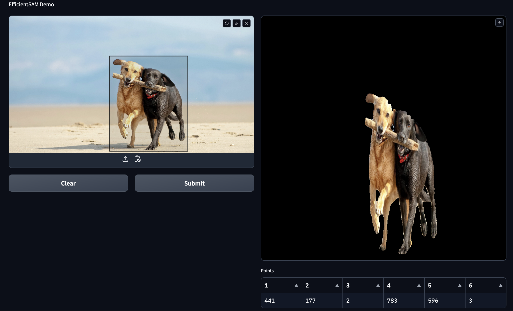

# EfficientSAM Tensorflow Demo

Including: `tflite` and `TensorFlow.js`

<p>
    <em>EfficienSAM-Ti</em>
    
</p>

<p>
    <em>EfficienSAM-S</em>
    
</p>

## Examples

By default, we are using `EfficientSAM-Ti`, if you want to use `EfficientSAM-S` just add an argument **`"--model small"`** to the below command.

#### 1. SavedModel

```bash
$ python3 EfficientSAM_example.py
```

#### 2. TFLite model:

```bash
$ python3 EfficientSAM_example.py --use_tflite
```

#### 3. TensorFlow.js

Please see this repo [kaka-lin/tfjs-demo](https://github.com/kaka-lin/tfjs-demo)

#### 4. WebUI that make with [Gradio](https://www.gradio.app/)

```bash
$ python3 app.py
```



## Acknowledgement

+ [SAM](https://github.com/facebookresearch/segment-anything)
+ [MobileSAM](https://github.com/ChaoningZhang/MobileSAM)
+ [FastSAM](https://github.com/CASIA-IVA-Lab/FastSAM)
+ [U-2-Net](https://github.com/xuebinqin/U-2-Net)

If you're using EfficientSAM in your research or applications, please cite using this BibTeX:

```bibtex
@article{xiong2023efficientsam,
  title={EfficientSAM: Leveraged Masked Image Pretraining for Efficient Segment Anything},
  author={Yunyang Xiong, Bala Varadarajan, Lemeng Wu, Xiaoyu Xiang, Fanyi Xiao, Chenchen Zhu, Xiaoliang Dai, Dilin Wang, Fei Sun, Forrest Iandola, Raghuraman Krishnamoorthi, Vikas Chandra},
  journal={arXiv:2312.00863},
  year={2023}
}
```
